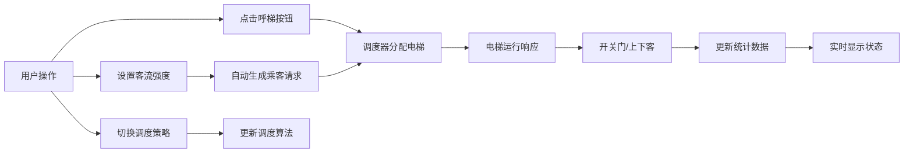

## 1. 产品概述

基于Three.js的3D电梯群控系统模拟器，用于可视化展示和测试不同电梯调度算法的效率。主要面向智能建筑研究、电梯系统设计人员以及算法学习者，提供交互式的电梯运行模拟环境。

## 2. 核心功能

### 2.1 用户角色
| 角色 | 注册方式 | 核心权限 |
|------|----------|----------|
| 普通用户 | 无需注册 | 操作呼梯按钮、切换调度策略、设置客流强度、查看统计数据 |

### 2.2 功能模块
1. **3D电梯场景**：6层建筑模型，2部并排电梯（A梯和B梯），电梯井道可视化
2. **电梯控制系统**：电梯运行、开关门动画、楼层显示、轿厢内按钮
3. **调度策略系统**：就近响应、均衡负载、高峰期模式三种调度算法
4. **呼梯交互系统**：每层上下行呼梯按钮，轿厢内楼层选择按钮
5. **状态监控系统**：实时显示电梯楼层、运行状态、载重量
6. **统计分析系统**：平均候梯时间、最长候梯时间、电梯启停次数统计
7. **乘客模拟系统**：随机生成乘客请求，支持低/中/高三种客流强度

### 2.3 页面详情
| 页面名称 | 模块名称 | 功能描述 |
|---------|----------|----------|
| 主页面 | 3D场景区域 | 6层建筑和2部电梯的3D可视化，支持鼠标旋转缩放 |
| 主页面 | 左侧控制面板 | 调度策略选择、客流强度设置、模拟控制按钮 |
| 主页面 | 右侧状态面板 | 电梯A/B实时状态显示（楼层、方向、载重、状态） |
| 主页面 | 底部统计面板 | 候梯时间统计、启停次数统计、运行时间显示 |
| 主页面 | 建筑呼梯区 | 每层楼的上行/下行呼梯按钮，点击可呼叫电梯 |

## 3. 核心流程

用户打开页面→查看3D电梯场景→点击楼层呼梯按钮→系统根据调度策略分配电梯→电梯运行响应→乘客上下→统计数据更新。用户可切换调度策略、启动自动乘客模拟，观察不同算法的效率差异。

## 4. 用户界面设计

### 4.1 设计风格
- **主色调**：深空蓝（#0a1628）作为背景，科技蓝（#00d4ff）作为主色，橙红色（#ff6b35）作为警示色，绿色（#00ff88）作为运行正常色
- **按钮风格**：玻璃拟态风格，圆角8px，发光边框效果
- **字体**：使用JetBrains Mono作为数字显示字体，Rajdhani作为标题字体，系统默认sans-serif作为正文字体
- **布局风格**：左侧控制面板+中央3D场景+右侧状态面板的三栏布局，底部悬浮统计条
- **图标风格**：使用Font Awesome图标，配合发光效果

### 4.2 页面设计概述
| 页面名称 | 模块名称 | UI元素 |
|---------|----------|--------|
| 主页面 | 3D场景区域 | 6层建筑模型，电梯轿厢动画，楼层指示灯，玻璃质感材质 |
| 主页面 | 左侧控制面板 | 策略选择下拉框，客流强度滑块，开始/暂停/重置按钮 |
| 主页面 | 右侧状态面板 | 电梯A/B卡片，状态指示器，进度条，数字动画 |
| 主页面 | 底部统计面板 | 实时数据仪表，图表，统计指标 |
| 主页面 | 建筑呼梯区 | 每层楼的上下箭头按钮，指示灯状态 |

### 4.3 响应性
桌面端优先设计，支持1280px及以上分辨率。3D场景自适应窗口大小，控制面板最小宽度300px，在小屏幕上可折叠。

### 4.4 3D场景指导
- **环境和氛围**：暗色系科技风格，使用深蓝色环境光，配合点光源模拟电梯井道灯光
- **光照设置**：环境光（强度0.4）+ 方向光（模拟天花板灯光，强度0.8）+ 电梯轿厢内点光源
- **相机设置**：初始位置(8, 5, 12)，看向场景中心(0, 3, 0)，支持OrbitControls交互
- **构图和焦点元素**：建筑居中，电梯井道在建筑前侧，楼层标签清晰可见
- **交互和动画**：电梯上下移动平滑动画，开关门插值动画，按钮点击反馈，楼层指示灯闪烁
- **后处理效果**：Bloom泛光效果，轻微抗锯齿，营造科技感
- **性能预算**：使用instancedMesh优化楼层重复元素，目标帧率60fps

## 5. 非功能性需求
- **性能要求**：3D场景渲染帧率≥45fps，UI响应延迟≤100ms
- **可扩展性**：调度策略可插拔设计，便于新增算法
- **可观测性**：所有状态变化可追踪，便于调试和分析
