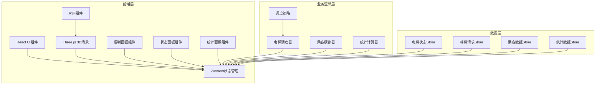
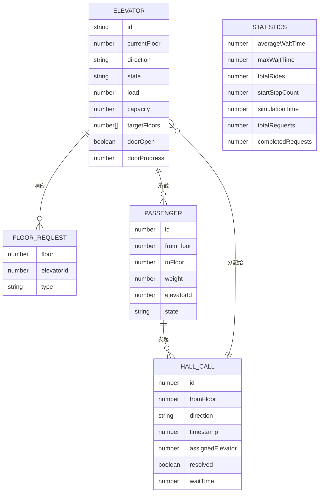

## 1. 架构设计



## 2. 技术描述

- **前端**：React@18 + TypeScript + Vite
- **3D渲染**：three @react-three/fiber @react-three/drei @react-three/postprocessing
- **状态管理**：zustand
- **样式**：tailwindcss@3
- **图标**：@fortawesome/fontawesome-svg-core @fortawesome/free-solid-svg-icons @fortawesome/react-fontawesome
- **初始化工具**：vite-init
- **后端**：None（纯前端应用）
- **数据库**：None（内存状态管理）

## 3. 路由定义

| 路由 | 用途 |
|------|------|
| / | 主页面，包含3D场景、控制面板、状态面板、统计面板 |

## 4. 数据模型

### 4.1 数据模型定义



### 4.2 TypeScript类型定义

```typescript
// 电梯状态类型
type ElevatorDirection = 'up' | 'down' | 'idle';
type ElevatorState = 'idle' | 'moving' | 'opening' | 'open' | 'closing';

interface Elevator {
  id: string;
  name: string;
  currentFloor: number;
  targetY: number;
  direction: ElevatorDirection;
  state: ElevatorState;
  load: number;
  capacity: number;
  targetFloors: number[];
  doorOpen: boolean;
  doorProgress: number;
  passengers: Passenger[];
}

// 呼梯请求类型
interface HallCall {
  id: number;
  fromFloor: number;
  direction: 'up' | 'down';
  timestamp: number;
  assignedElevator: string | null;
  resolved: boolean;
  resolvedTime: number | null;
  passengerId: number | null;
}

// 乘客类型
interface PassengerState = 'waiting' | 'entering' | 'riding' | 'exiting' | 'completed';

interface Passenger {
  id: number;
  fromFloor: number;
  toFloor: number;
  weight: number;
  elevatorId: string | null;
  state: PassengerState;
  createdAt: number;
}

// 调度策略类型
type SchedulingStrategy = 'nearest' | 'balanced' | 'peak';

// 统计数据类型
interface Statistics {
  averageWaitTime: number;
  maxWaitTime: number;
  totalRides: number;
  startStopCount: Record<string, number>;
  simulationTime: number;
  totalRequests: number;
  completedRequests: number;
  waitTimes: number[];
}

// 客流强度
type PassengerIntensity = 'low' | 'medium' | 'high';

// 应用状态
interface AppState {
  elevators: Elevator[];
  hallCalls: HallCall[];
  passengers: Passenger[];
  statistics: Statistics;
  strategy: SchedulingStrategy;
  intensity: PassengerIntensity;
  isRunning: boolean;
  isPaused: boolean;
  simulationSpeed: number;
}
```

## 5. 核心模块设计

### 5.1 调度策略模块

| 策略名称 | 算法描述 | 适用场景 |
|---------|----------|----------|
| 就近响应 | 选择距离呼梯楼层最近且同向运行的电梯 | 常规客流 |
| 均衡负载 | 综合考虑距离、当前负载和待处理请求数 | 中等客流 |
| 高峰期模式 | 优先响应主客流方向（如早高峰上行），分区调度 | 早晚高峰 |

### 5.2 电梯状态机

```
IDLE → MOVING (收到目标楼层)
MOVING → OPENING (到达目标楼层)
OPENING → OPEN (门完全打开)
OPEN → CLOSING (乘客上下完成)
CLOSING → MOVING (有新目标) / IDLE (无目标)
```

### 5.3 项目目录结构

```
src/
├── components/
│   ├── ElevatorScene/       # 3D场景组件
│   │   ├── Building.tsx     # 建筑模型
│   │   ├── ElevatorCar.tsx  # 电梯轿厢
│   │   ├── ElevatorShaft.tsx# 电梯井道
│   │   ├── FloorIndicator.tsx # 楼层指示器
│   │   └── index.tsx
│   ├── ControlPanel/        # 左侧控制面板
│   │   ├── StrategySelector.tsx
│   │   ├── IntensitySlider.tsx
│   │   ├── ControlButtons.tsx
│   │   └── index.tsx
│   ├── StatusPanel/         # 右侧状态面板
│   │   ├── ElevatorCard.tsx
│   │   ├── StatusIndicator.tsx
│   │   └── index.tsx
│   ├── StatsPanel/          # 底部统计面板
│   │   ├── StatsCards.tsx
│   │   ├── StatsChart.tsx
│   │   └── index.tsx
│   └── HallCallButtons/     # 呼梯按钮
│       └── index.tsx
├── store/
│   └── useElevatorStore.ts  # Zustand状态管理
├── logic/
│   ├── scheduler/           # 调度算法
│   │   ├── nearest.ts
│   │   ├── balanced.ts
│   │   ├── peak.ts
│   │   └── index.ts
│   ├── elevatorController.ts # 电梯控制逻辑
│   ├── passengerSimulator.ts # 乘客模拟
│   └── statistics.ts        # 统计计算
├── types/
│   └── index.ts             # TypeScript类型定义
├── config/
│   └── constants.ts         # 常量配置
├── App.tsx
├── main.tsx
└── index.css
```

## 6. 关键技术实现要点

1. **3D动画性能**：使用useFrame钩子实现平滑动画，电梯位置通过lerp插值计算
2. **调度器设计**：采用策略模式，便于新增调度算法
3. **状态管理**：Zustand分模块管理电梯、呼梯、乘客、统计状态
4. **时间模拟**：支持加速模拟，通过simulationSpeed控制
5. **性能优化**：使用instancedMesh创建重复的楼层元素，减少draw call
